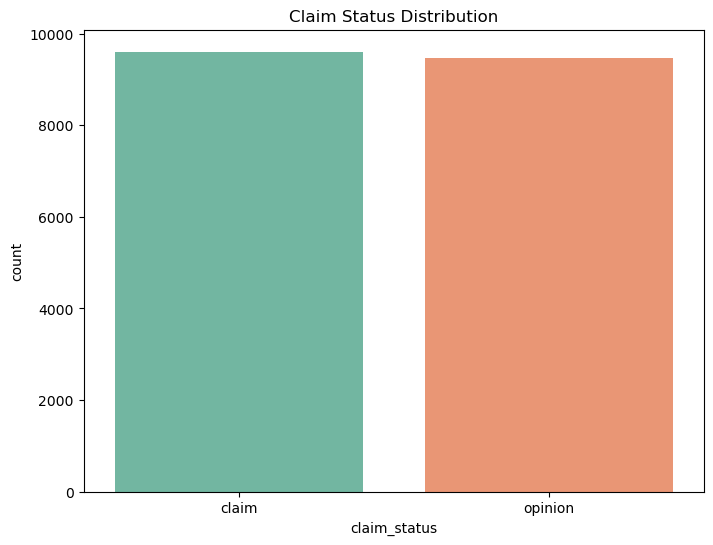
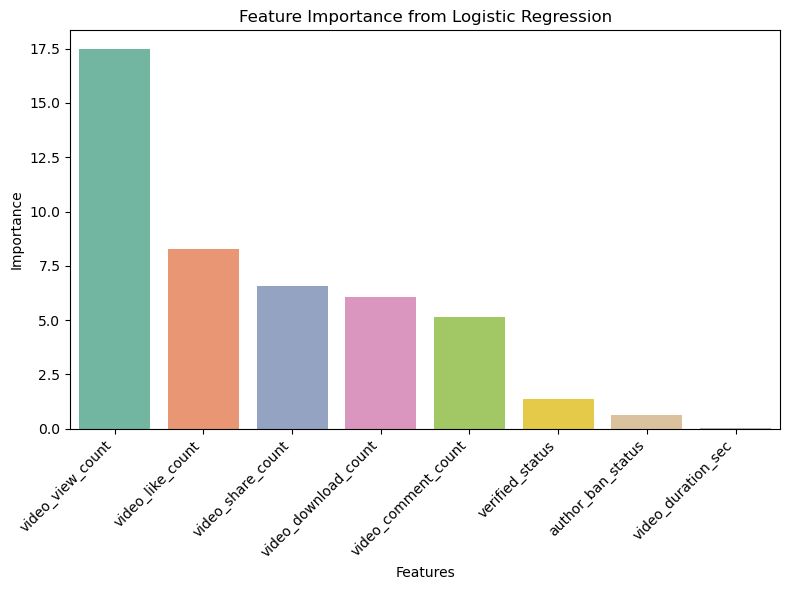

# TikTok Video Classification using Logistic Regression

## Overview
The unprecedented rise of social media platforms has revolutionized the way we consume and interact with content. Among these platforms, TikTok has emerged as a global phenomenon, captivating millions of users with its short-form, engaging videos. As the volume of content on TikTok continues to surge, distinguishing between factual claims and subjective opinions within these videos becomes an essential challenge. This project  aims to develop an intelligent classification system that can discern between objective claims and subjective opinions presented in TikTok videos. By analyzing the metadata of TikTok videos, this project aim to build a robust binary classification model that can accurately categorize videos into two primary classes: "claim" and "opinion". Metadata refers to the descriptive information associated with each video, such as the number of likes, comments, shares, video duration and verified status.

## Data Understanding
The dataset consisted of approximately 20k unique videos and 12 features. Each video is labeled either as "claim" or "opinion". The bar chart below shows the breakdown of how many video labeled as "claim" or "opinion"

## Modeling and Evaluation
A Logistic Regression model is used to predict whether a video is a claim or an opinion using the metadata. The overall accuracy of 0.98 indicates the proportion of correctly classified instances out of the total dataset. The macro and weighted average metrics, both at 0.98, suggest a well-balanced performance across classes, considering their respective supports.

